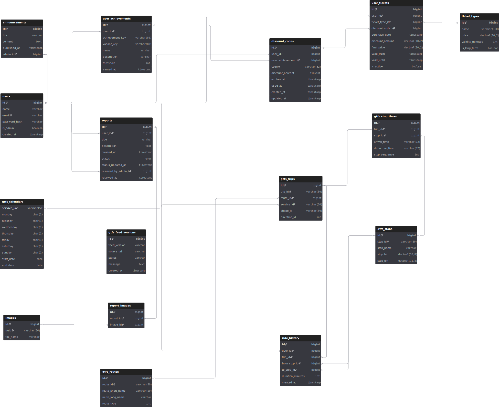
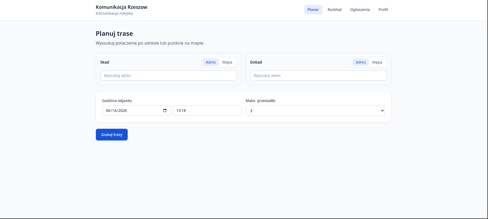
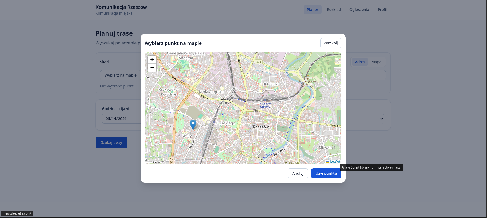
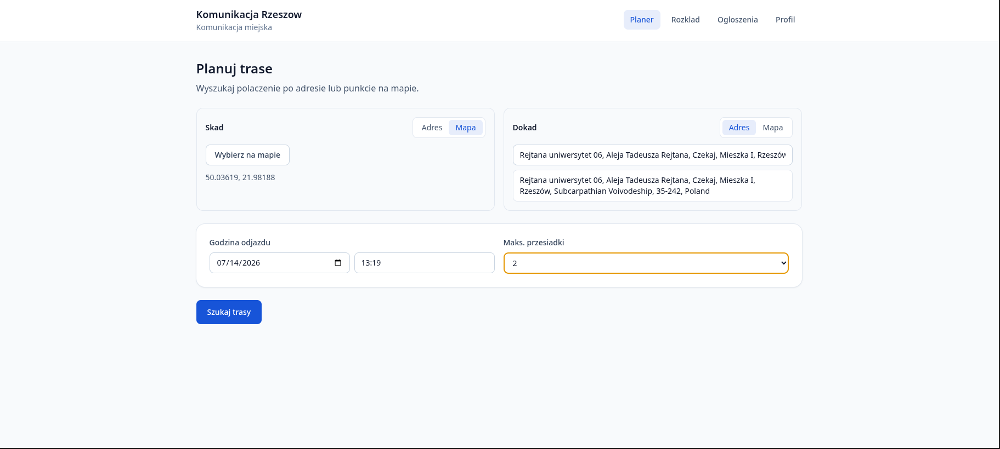
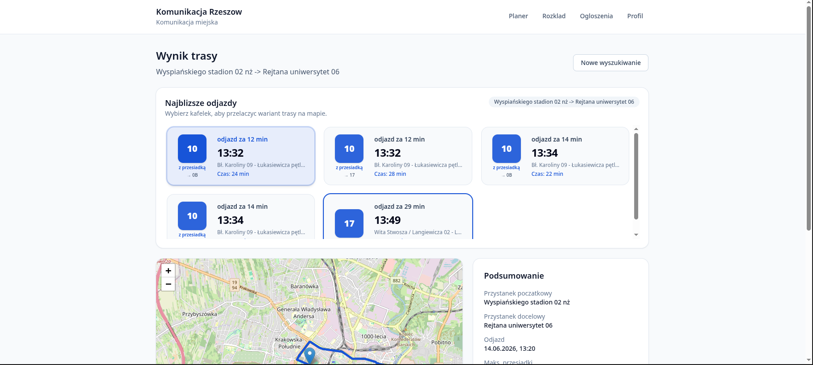
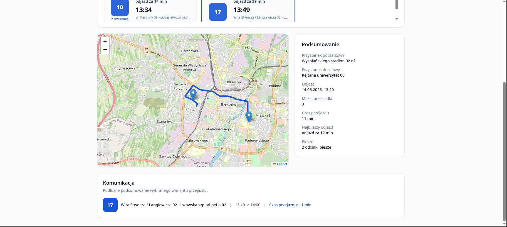
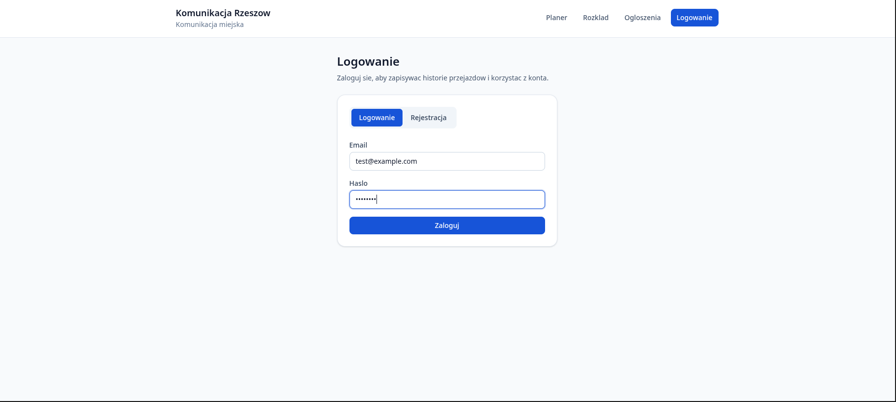
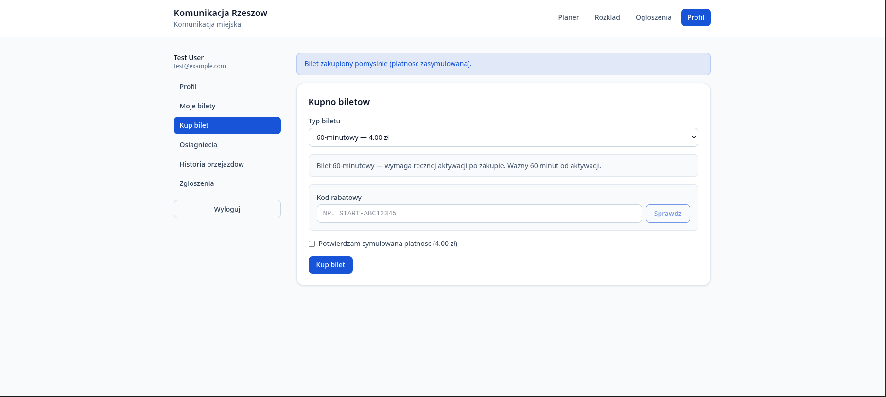
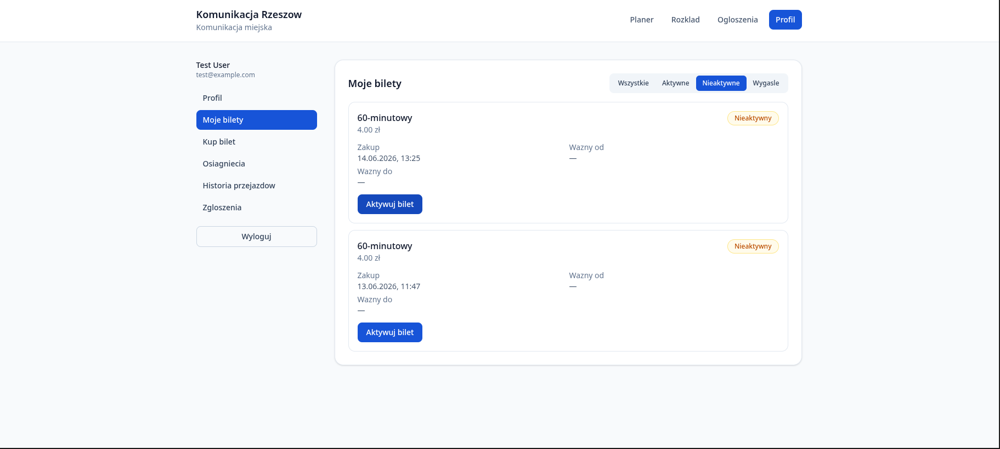
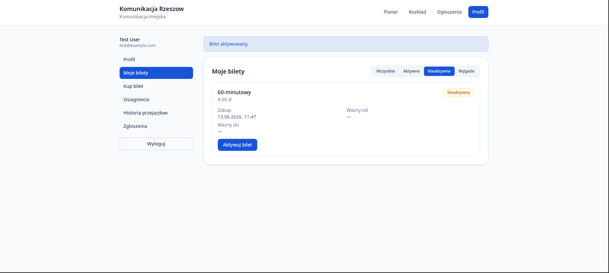

# Dokumentacja projektu - Komunikacja Rzeszów (AI2)

Aplikacja internetowa wspierająca korzystanie z miejskiej komunikacji publicznej w Rzeszowie: planowanie tras, rozkłady jazdy, bilety, zgłoszenia, ogłoszenia oraz panel administratora.

---

## 1. Autorzy i podział ról

| Osoba | Git / branch | Rola w projekcie | Zakres odpowiedzialności |
|-------|--------------|------------------|--------------------------|
| Piotr Brzoza | `pi0tr010` · `piotr-feature-branch` | DevOps / integracje / backend | Docker Compose, pgAdmin, backup bazy, synchronizacja GTFS i harmonogram `gtfs:sync`, mikroserwis `route-planner` (Python), endpointy planowania trasy i rozkładów (`plan-route`, `schedules`), geokodowanie adresów (Rzeszów), scalanie pracy zespołu (`integracja szymona`, `integracja dominika`, `integracja z częścią olki`) |
| Aleksandra Cyboroń | `olka-feature-branch` *(fork - brak konta w repozytorium głównym)* | Frontend / backend (funkcje użytkownika) | Planowanie trasy i wyniki (React), widok rozkładu jazdy, konto użytkownika (`AccountSettingsPage`), logowanie, osiągnięcia i kody rabatowe (`AchievementService`), eksport danych RODO, generowanie PDF rozkładów (`SchedulePdfService`) - zmiany włączone przez `pi0tr010` (commity: `pobranie z forka aleksandry`, `integracja z częścią olki`) |
| Dominik Lech | `Dolidodzik` · `dominik-feature-branch` | Panel administratora / CMS | Logowanie admina, CRUD ogłoszeń z edytorem WYSIWYG i uploadem obrazków, layout panelu admina, statystyki, widok ogłoszeń po stronie klienta, filtrowanie / wyszukiwanie / sortowanie zgłoszeń w panelu admina |
| Szymon Budziński | `S-Budzinski` · `szymon-feature-branch` | Backend API / frontend (konto użytkownika) | Rejestracja i logowanie (Laravel Sanctum), zarządzanie profilem, bilety (typy, zakup, aktywacja), historia przejazdów, zgłoszenia użytkownika ze zdjęciami, walidacja API (`ApiValidationTest`), podstawowy układ i design aplikacji klienckiej |

**Repozytorium GitHub:** https://github.com/Dolidodzik/ai-projekt

---


## 3. Użyte technologie

### Backend
| Technologia | Wersja / opis |
|-------------|---------------|
| PHP | 8.4 |
| Laravel | 12.x |
| Laravel Sanctum | Autoryzacja API (tokeny) |
| PostgreSQL | 16 |
| Nginx | Reverse proxy |
| Python (FastAPI/Uvicorn) | Mikroserwis `route-planner` - silnik planowania tras |

### Frontend
| Technologia | Wersja / opis |
|-------------|---------------|
| React | 19 |
| TypeScript | 6 |
| Vite | 8 |
| Tailwind CSS | 4 |
| React Router | 7 |
| Leaflet / react-leaflet | Mapy tras |

### DevOps i narzędzia
| Technologia | Opis |
|-------------|------|
| Docker Compose | Orkiestracja kontenerów |
| pgAdmin 4 | Zarządzanie bazą danych (http://localhost:5050) |
| GTFS | Import rozkładów MPK Rzeszów (`gtfs:sync`) |

### Architektura

```
┌─────────────┐     ┌─────────────┐     ┌──────────────┐
│  React SPA  │────▶│   Nginx     │────▶│  Laravel API │
│  :5173      │     │   :8080     │     │  (PHP-FPM)   │
└─────────────┘     └─────────────┘     └──────┬───────┘
                                               │
                    ┌──────────────────────────┼──────────────────┐
                    ▼                          ▼                  ▼
             ┌─────────────┐          ┌─────────────┐    ┌──────────────┐
             │ PostgreSQL  │          │ Route       │    │ Panel admina │
             │ :5432       │          │ Planner     │    │ (Blade)      │
             └─────────────┘          │ :8000       │    └──────────────┘
                                      └─────────────┘
```

---

## 4. Przeznaczenie aplikacji

System **Komunikacja Rzeszów** służy mieszkańcom i pasażerom MPK Rzeszów do:

- **planowania podróży** komunikacją miejską (trasa piesza + autobusy),
- **przeglądania rozkładów jazdy** linii i przystanków,
- **czytania ogłoszeń** operatora (objazdy, zmiany taryf),
- **kupowania i aktywacji biletów** (symulacja płatności),
- **zgłaszania problemów** (uszkodzona wiata, opóźnienia) ze zdjęciami,
- **śledzenia historii przejazdów** i **odblokowywania osiągnięć** z kodami rabatowymi.

Panel administratora umożliwia publikowanie ogłoszeń, obsługę zgłoszeń i podgląd statystyk.

---

## 5. Opis funkcjonalności

### 5.1 Aplikacja użytkownika (React - http://localhost:5173)

| Moduł | Ścieżka | Opis |
|-------|---------|------|
| Planowanie trasy | `/` | Wybór punktu start/koniec (adres lub mapa), wyszukiwanie po Rzeszowie, wyniki z mapą |
| Wyniki trasy | `/results` | Lista propozycji połączeń, szczegóły przejazdu |
| Rozkład jazdy | `/schedule` | Wybór linii, przystanku, daty; podgląd odjazdów i trasy na mapie |
| Ogłoszenia | `/announcements` | Lista ogłoszeń MPK |
| Szczegóły ogłoszenia | `/announcements/:id` | Treść HTML ze zdjęciami |
| Logowanie / rejestracja | `/sign-in` | Konto użytkownika (Sanctum token) |
| Konto - profil | `/account/profil` | Edycja imienia, e-maila, hasła; eksport danych |
| Konto - bilety | `/account/bilety` | Kupno, aktywacja, lista biletów |
| Konto - historia | `/account/historia` | Historia wyszukanych tras (**paginacja**) |
| Konto - zgłoszenia | `/account/zgloszenia` | Wysyłanie zgłoszeń ze zdjęciami |
| Konto - osiągnięcia | `/account/osiagniecia` | Postęp, kody rabatowe |


### 5.2 Panel administratora (Laravel Blade - http://localhost:8080)

| Moduł | Ścieżka | Opis |
|-------|---------|------|
| Logowanie admina | `/login` | Tylko konta z `is_admin = true` |
| Statystyki | `/admin_panel/` | Podsumowanie: użytkownicy, bilety, zgłoszenia, trasy |
| Zgłoszenia | `/admin_panel/reports` | **Wyszukiwanie**, **filtrowanie** statusu, **sortowanie** |
| Szczegóły zgłoszenia | `/admin_panel/reports/{id}` | Podgląd, zmiana statusu, zdjęcia |
| Ogłoszenia - CRUD | `/admin_panel/announcements` | Create, Read, Update, Delete + upload obrazków |


### 5.3 REST API (http://localhost:8080/api)

| Metoda | Endpoint | Auth | Opis |
|--------|----------|------|------|
| POST | `/auth/register` | - | Rejestracja |
| POST | `/auth/login` | - | Logowanie (token) |
| GET | `/announcements` | - | Lista ogłoszeń |
| GET | `/plan-route` | - | Planowanie trasy |
| GET | `/schedules/...` | - | Rozkłady jazdy |
| GET | `/auth/me` | Token | Profil użytkownika |
| PATCH | `/auth/profile` | Token | Aktualizacja profilu |
| POST | `/tickets/purchase` | Token | Kupno biletu |
| GET | `/ride-history` | Token | Historia (paginacja) |
| POST | `/reports` | Token | Nowe zgłoszenie |
| GET | `/users` | Admin | Lista użytkowników |

---

## 6. Schemat ERD





---

## 7. Instrukcja uruchomienia (krok po kroku)

### Wymagania wstępne

- Docker i Docker Compose
- Git
- Architektura **x86-64**
- Porty wolne: **8080**, **5173**, **5432**, **5050**

### Kroki

**1. Sklonuj repozytorium**

```bash
git clone <url-repozytorium>
cd ai-projekt-1
```

**2. Skonfiguruj środowisko**

```bash
cp .env.example .env
```

W pliku `.env` ustaw co najmniej `APP_KEY` (patrz krok 4).

**3. Uruchom kontenery**

```bash
docker compose up --build
```

Przy **pierwszym uruchomieniu**:
- PostgreSQL przywraca backup z `backend/database/backups/ai2_projekt.dump`
- Laravel uruchamia migracje
- Sprawdzana jest aktualność danych GTFS (`gtfs:sync`)

**4. Wygeneruj klucz aplikacji**

```bash
docker compose exec app php artisan key:generate --show
```

Skopiuj wartość do `.env` jako `APP_KEY=base64:...`, następnie:

```bash
docker compose restart
```

**5. Otwórz aplikację**

| Usługa | Adres |
|--------|-------|
| Frontend (użytkownik) | http://localhost:5173 |
| Backend + panel admina | http://localhost:8080 |
| pgAdmin | http://localhost:5050 |

**6. pgAdmin - połączenie z bazą**

| Pole | Wartość |
|------|---------|
| Host | `db` (w sieci Docker) lub `host.docker.internal` / `localhost` |
| Port | `5432` |
| Baza | `ai2_projekt` |
| Użytkownik | `ai2_user` |
| Hasło | `ai2_secret` |


### Konta demo (z backupu)

| Rola | E-mail | Hasło |
|------|--------|-------|
| Administrator (panel) | `admin@example.com` | `password123` |
| Użytkownik testowy | `test@example.com` | `password` |
| Inni użytkownicy demo | `*@example.com` | `password123` |

### Reset bazy do stanu początkowego

```bash
docker compose down -v
docker compose up --build
```

---

## 8. Reprezentatywny przebieg użytkowania (logika biznesowa)

### Pasażer planuje i kupuje bilet

1. Użytkownik wchodzi na http://localhost:5173 i wybiera **Planowanie trasy**.

2. Wpisuje adres startu i celu (geokodowanie ograniczone do Rzeszowa).


3. Aplikacja wywołuje `GET /api/plan-route` → Laravel → mikroserwis Python `route-planner` → wynik z połączeniami GTFS.


4. Użytkownik loguje się (`POST /api/auth/login`), zapisuje trasę w historii (`POST /api/ride-history/add`).

5. Przechodzi do **Konto → Bilety**, wybiera typ biletu, potwierdza symulowaną płatność (`POST /api/tickets/purchase`).

6. Dla biletu 60-minutowego aktywuje bilet (`POST /api/tickets/{id}/activate`).




---

## 9. Kierunki dalszego rozwoju

| Obszar | Opis | Priorytet |
|--------|------|-----------|
| Bootstrap w panelu admina | Dopasowanie do wymagań projektowych (obecnie Tailwind) | Wysoki |
| Paginacja zgłoszeń admina | Pełne spełnienie wymogu listy z 4 funkcjami | Wysoki |
| CRUD użytkowników w panelu | UI zamiast samego API | Średni |
| Refaktoryzacja admin ogłoszeń | Przeniesienie logiki z `web.php` do kontrolera | Średni |
| Prawdziwa bramka płatności | Integracja PayU / Przelewy24 zamiast symulacji | Niski |
| Powiadomienia push / e-mail | Status zgłoszenia, wygaśnięcie biletu | Niski |
| Testy E2E | Cypress/Playwright dla krytycznych ścieżek | Średni |
| i18n | Wersja angielska interfejsu | Niski |


---

